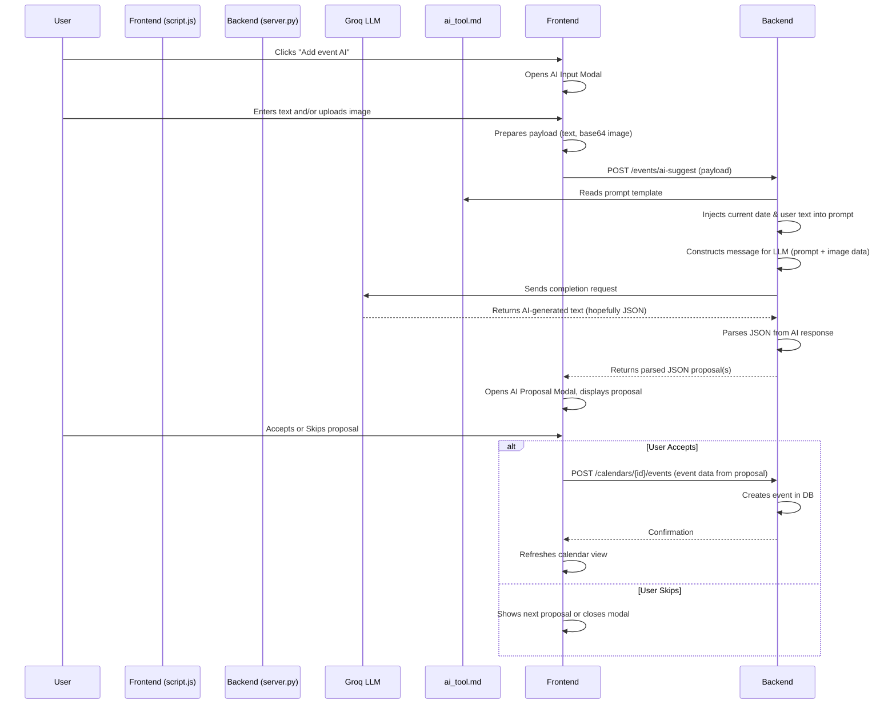

# AI Event Suggestion Feature

The AI event suggestion feature allows users to create calendar events using natural language text input or by providing an image. The system leverages a Large Language Model (LLM) via the Groq API to interpret the input and propose event details.

## Workflow Overview

The process involves interaction between the frontend (web interface), the backend server, and the external Groq AI service.

### 1. Frontend Interaction (`web-frontend/index.html`, `web-frontend/script.js`)

1.  **Trigger:**
    *   The user clicks the "Add event AI" button (`newEventAIBtn`) on the sidebar.

2.  **AI Input Modal (`aiInputModal`):**
    *   This action opens a modal dialog where the user can:
        *   Enter event details as text in a textarea (`aiText`). (e.g., "Lunch with John tomorrow at 1pm at The Cafe").
        *   Upload an image file (`aiImage`) that might contain event information (e.g., a screenshot of an invitation, a poster).
        *   The interface supports drag & drop and pasting images directly into a drop zone (`aiImageDropZone`).
    *   An image preview (`aiImagePreview`) is shown if an image is selected.

3.  **Data Preparation & API Request:**
    *   When the user submits the AI input form ("Get AI Suggestion" button):
        *   The text from `aiText` is retrieved.
        *   If an image file is provided, `script.js` uses `FileReader` to read the image and convert it into a base64 encoded string. Only the base64 data (after `data:...;base64,`) is kept.
        *   A JSON payload is constructed:
            ```json
            {
              "text": "user's text input or empty string",
              "image_b64": "base64_encoded_image_string or null"
            }
            ```
        *   An asynchronous POST request is made to the `/events/ai-suggest` endpoint on the backend server.

4.  **Handling AI Proposal (`aiProposalModal`):**
    *   The backend responds with a JSON object (or an array of JSON objects if multiple events are suggested) representing the AI's interpretation of the event.
    *   The AI input modal is closed, and the "AI Event Proposal" modal (`aiProposalModal`) opens.
    *   The raw JSON proposal from the AI is displayed in `aiProposalDetailsEl`.
    *   If the AI suggests multiple events, they are presented to the user one by one. The modal title indicates the current proposal number (e.g., "AI Event Proposal (1/2)").

5.  **User Action on Proposal:**
    *   **Accept (`aiProposalAcceptBtn`):**
        *   The user clicks "Add Event".
        *   `script.js` takes the currently displayed AI proposal.
        *   It determines the target `calendar_id`:
            *   If the proposal includes a `calendar_name`, it tries to find a matching calendar.
            *   Otherwise, it defaults to the first available calendar. If no calendars exist, an alert is shown.
        *   It constructs the event data for the API, mapping fields from the AI's proposal (e.g., `title`, `description`, `start_time`, `end_time`, `is_all_day`, `repeat_frequency`, `repeat_until`). Default values are used if some fields are missing from the AI proposal.
        *   A POST request is made to the `/calendars/{calendarId}/events` endpoint to create the event in the selected calendar.
        *   After attempting to create the event, the system moves to the next proposal (if any). If there are no more proposals, the modal is closed, and the main calendar view is refreshed.
    *   **Skip/Deny (`aiProposalDenyBtn`):**
        *   The user clicks "Skip".
        *   The current proposal is discarded, and the system moves to the next proposal or closes the modal if all proposals have been processed.

### 2. Backend Processing (`server.py`)

1.  **Endpoint `/events/ai-suggest`:**
    *   The `upload_data` asynchronous function handles requests to this endpoint.
    *   It expects an `AISuggestPayload` which can contain `text` (string) and `image_b64` (base64 encoded string).
    *   It validates that at least one of `text` or `image_b64` is provided.

2.  **Prompt Construction:**
    *   The backend reads the content of the `ai_tool.md` file. This file contains the system prompt and instructions for the LLM.
    *   The placeholder `[[REPLACE_CURRENT_DATE]]` within the `ai_tool.md` content is replaced with the current server's date (formatted as `YYYY-MM-DD`). This gives the AI temporal context.
    *   The user's `text` input (if any) is injected into the `[[REPLACE_EVENT_INFO]]` placeholder in the prompt.
    *   A `message_content` list is prepared for the AI model. This list always contains a "text" part with the modified prompt.
    *   If `image_b64` was provided by the frontend, an "image_url" part is appended to `message_content`. The image URL is formatted as a data URL: `data:image/png;base64,{image_b64}`.

3.  **AI Model Invocation (Groq API):**
    *   A Groq API client is initialized using an API key (read from a local `groq.token` file via `get_groq_api_key()`).
    *   The `client.chat.completions.create` method is called to send the request to the LLM. Key parameters include:
        *   `model`: The specific AI model to use (e.g., `meta-llama/llama-4-scout-17b-16e-instruct`, as defined by `ai_model_name`).
        *   `messages`: A list containing a single message with the "user" role and the constructed `message_content` (which includes the prompt and potentially the image).
        *   `temperature`, `max_tokens`, `top_p`: Parameters to control the AI's output generation.

4.  **Response Handling:**
    *   The AI's response text is extracted from `completion.choices[0].message.content`.
    *   For debugging/logging purposes, this raw response text is written to a file named `ai_tool_response.txt`.
    *   The backend then attempts to parse this text to find a valid JSON structure. It looks for the first occurrence of a JSON object (`{...}`) or a JSON array (`[...]`).
    *   If a valid JSON structure is found and parsed successfully, this JSON data is returned to the frontend.
    *   If the AI's response does not contain a recognizable JSON object/array or if parsing fails, an error JSON `{"error": "Invalid response format."}` is returned to the frontend with HTTP status code 420.

### 3. AI Prompt (`ai_tool.md`)

This Markdown file is crucial as it guides the LLM's behavior.

*   **Purpose:** It instructs the LLM on how to interpret the user's input (text and/or image) and what format to use for its response.
*   **Content:**
    *   It describes the tool as a "calendar event creation API."
    *   It specifies the desired output format: a valid JSON object (or an array of objects for multiple events).
    *   It provides the schema for the JSON object, including fields like `title`, `description`, `location`, `start_time`, `end_time`, `is_all_day`, `repeat_frequency`, and `repeat_until`. The `Time` format is also specified (`{YYYY}-{MM}-{DD}T{HH}:{MM}:{SS}.{ms}Z`).
    *   It instructs the AI to use information from "Event Info" (which will be the user's text) or an attached image.
    *   It states that an empty JSON object `{}` should be returned if no relevant information can be extracted.
    *   It includes two placeholders:
        *   `[[REPLACE_CURRENT_DATE]]`: Dynamically replaced by the backend with the current date.
        *   `[[REPLACE_EVENT_INFO]]`: Dynamically replaced by the backend with the user's text input.

## Data Flow Summary



This system provides a flexible way for users to create events by leveraging the natural language understanding capabilities of an LLM.
